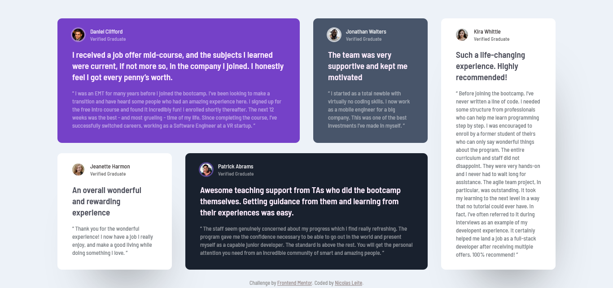
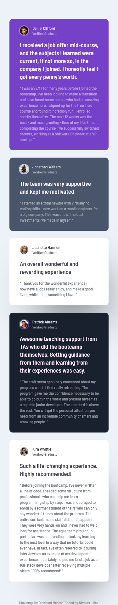

# Frontend Mentor - Testimonials grid section solution

This is a solution to the [Testimonials grid section challenge on Frontend Mentor](https://www.frontendmentor.io/challenges/testimonials-grid-section-Nnw6J7Un7).
## Table of contents

- [Overview](#overview)
  - [The challenge](#the-challenge)
  - [Screenshot](#screenshot)
  - [Links](#links)
- [My process](#my-process)
  - [Built with](#built-with)
  - [What I learned](#what-i-learned)
  - [Continued development](#continued-development)
  - [Useful resources](#useful-resources)

**Note: Delete this note and update the table of contents based on what sections you keep.**

## Overview

### The challenge

Users should be able to:

- View the optimal layout for the site depending on their device's screen size

### Screenshot

Desktop:

Mobile:

### Links

- Solution URL: [Add solution URL here](https://your-solution-url.com)
- Live Site URL: (https://nicolas055.github.io/Testimonials-grid-section-main-Challenge/)

## My process

### Built with

- Semantic HTML5 markup
- CSS custom properties
- Flexbox
- CSS Grid
- Mobile-first workflow
- VS code extension

### What I learned

- CSS Grid
- Responsiveness
- Different uses for the background property

### Continued development

I want to keep improving my CSS Grid skills and use more mobile-first workflow in my future projects.

### Useful resources

- [Resource 1](https://www.cssmatic.com) - This helped me make a box-shadow in my element.
- [Resource 2](https://www.w3schools.com) - This helped me to learn about some properties I didn't know very well.

## Author

- Frontend Mentor - [@nicolas055](https://www.frontendmentor.io/profile/nicolas55)
- Instagram - [nicolas_leite2](https://www.instagram.com/nicolas_leite2)

